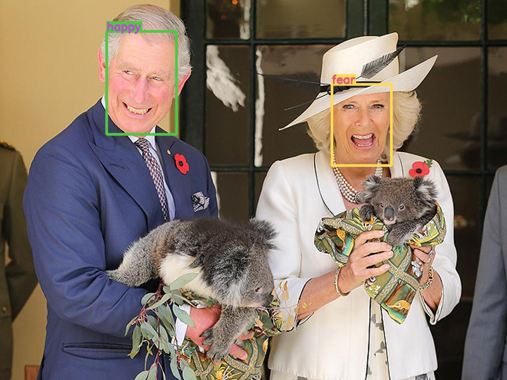
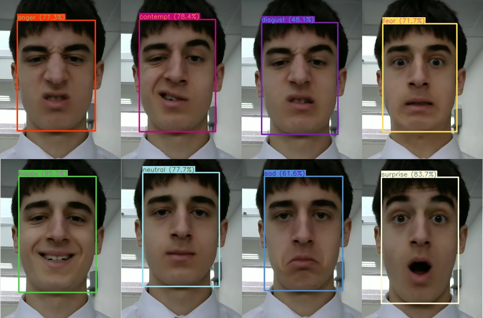

# Real-Time Emotion Detection using YOLOv7 and RepVGG

[](https://www.python.org/downloads/)
[](https://pytorch.org/)
[](https://opensource.org/licenses/MIT)

A high-performance, real-time emotion detection system that combines **YOLOv7** for robust face detection and **RepVGG** for accurate emotion classification. This system can process live video streams, images, and video files to detect and classify human emotions with high accuracy and speed.

## 🚀 Demo


*Real-time emotion detection on webcam feed*


*Eight emotion categories supported by the model*

## 📋 Table of Contents

- [Features](#-features)
- [Supported Emotions](#-supported-emotions)
- [Architecture](#-architecture)
- [Installation](#-installation)
- [Quick Start](#-quick-start)
- [Usage](#-usage)
- [Project Structure](#-project-structure)
- [Troubleshooting](#-troubleshooting)
- [Performance](#-performance)
- [Contributing](#-contributing)
- [License](#-license)
- [Acknowledgments](#-acknowledgments)

## ✨ Features

- **Real-time processing**: Optimized for live video streams with minimal latency
- **High accuracy**: 91% face detection accuracy and 87.5% emotion classification accuracy
- **Multiple input sources**: Support for webcam, images, and video files
- **Lightweight architecture**: Efficient RepVGG model for fast inference
- **Robust face detection**: YOLOv7-based detection works in challenging conditions
- **Easy deployment**: Simple setup with comprehensive documentation
- **Customizable output**: Flexible save options and visualization settings

## 😊 Supported Emotions

The model classifies faces into **8 distinct emotional categories**:

| Emotion | Description | Color Code |
|---------|-------------|------------|
| 😠 Anger | Frustration, irritation, rage | Red |
| 😤 Contempt | Disdain, superiority, scorn | Dark Red |
| 🤢 Disgust | Revulsion, distaste, aversion | Green |
| 😨 Fear | Anxiety, worry, terror | Purple |
| 😊 Happy | Joy, contentment, pleasure | Yellow |
| 😐 Neutral | Calm, emotionless, baseline | Gray |
| 😢 Sad | Sorrow, melancholy, grief | Blue |
| 😲 Surprise | Astonishment, shock, wonder | Orange |

Each detected face is automatically assigned an appropriate color-coded bounding box corresponding to the predicted emotion.

## 🏗 Architecture

The system consists of two main components working in pipeline:

### 🎯 Face Detection: YOLOv7-Tiny
- **Purpose**: Locates and extracts face regions from input frames
- **Model**: YOLOv7-Tiny optimized for face detection
- **Training Data**: WIDER FACE dataset (393,703 face annotations)
- **Performance**: 91% detection accuracy in real-world conditions
- **Features**: 
  - Handles partial occlusions (masks, sunglasses)
  - Robust to varying lighting conditions
  - Efficient anchor box optimization
  - Multi-scale detection capabilities

### 🧠 Emotion Classification: RepVGG
- **Purpose**: Classifies detected faces into emotion categories
- **Model**: RepVGG-A0 with structural re-parameterization
- **Training Data**: AffectNet dataset (420,299 facial expressions)
- **Performance**: 87.5% classification accuracy
- **Features**:
  - Lightweight 3×3 convolution architecture
  - Fast inference with reduced computational overhead
  - Superior performance vs ResNet and EfficientNet
  - Optimized for real-time applications

## 🛠 Installation

### Prerequisites

- Python 3.8 or higher
- CUDA-compatible GPU (recommended for optimal performance)
- Webcam (for real-time detection)

### Option 1: Conda Environment (Recommended)

```bash
# Clone the repository
git clone <[your-repository-url](https://github.com/ShyamSanjeyS/Real-Time-Emotion-Detection)>
cd emotion-detection

# Create and activate conda environment
conda env create -f env.yaml
conda activate emotion
```

### Option 2: Pip Installation

```bash
# Clone the repository
git clone <[your-repository-url](https://github.com/ShyamSanjeyS/Real-Time-Emotion-Detection)>
cd emotion-detection

# Install dependencies
pip install -r requirements.txt
```

### Download Model Weights

The system requires two pre-trained model files:

1. **YOLOv7 Face Detection Model**: `yolov7-tiny.pt`
2. **RepVGG Emotion Classification Model**: `repvgg.pth`

Place both files in the `weights/` directory:

```
weights/
├── yolov7-tiny.pt
└── repvgg.pth
```

> **Note**: Model weights are not included in the repository due to size constraints. Contact the repository maintainer for access or train your own models.

## 🚀 Quick Start

### Webcam Detection (Real-time)

```bash
python main.py --source 0
```

### Image Processing

```bash
python main.py --source path/to/image.jpg
```

### Video Processing

```bash
python main.py --source path/to/video.mp4
```

### Stop Webcam Detection

Press **`Q`** key while the video window is focused, or **`Ctrl+C`** in the terminal.

## 🎮 Usage

### Command Line Interface

```bash
python main.py [OPTIONS]
```

### Available Options

| Parameter | Default | Description |
|-----------|---------|-------------|
| `--source` | `0` | Input source (0=webcam, image path, video path) |
| `--img-size` | `512` | Inference image size in pixels |
| `--conf-thres` | `0.5` | Face detection confidence threshold |
| `--iou-thres` | `0.45` | IoU threshold for Non-Maximum Suppression |
| `--device` | `auto` | Device to run on (cpu, 0, 1, 2, 3...) |
| `--hide-img` | `False` | Hide result visualization window |
| `--output-path` | `output.mp4` | Path to save output video/images |
| `--no-save` | `False` | Disable saving output files |
| `--line-thickness` | `2` | Bounding box line thickness |
| `--hide-conf` | `False` | Hide confidence scores in labels |
| `--show-fps` | `False` | Display FPS in console |
| `--agnostic-nms` | `False` | Class-agnostic Non-Maximum Suppression |
| `--augment` | `False` | Augmented inference for higher accuracy |

### Examples

```bash
# High-confidence detection with thick bounding boxes
python main.py --source 0 --conf-thres 0.7 --line-thickness 3

# Process video and save output with FPS monitoring
python main.py --source video.mp4 --output-path results/output.mp4 --show-fps

# Batch process images without display
python main.py --source images/ --hide-img --no-save

# GPU-accelerated processing
python main.py --source 0 --device 0
```

## 📁 Project Structure

```
emotion-detection/
│
├── 📄 main.py                 # Main application entry point
├── 📄 emotion.py              # RepVGG emotion classification module
├── 📄 repvgg.py               # RepVGG model architecture definition
├── 📄 env.yaml                # Conda environment configuration
├── 📄 requirements.txt        # Pip dependencies
├── 📄 README.md               # Project documentation
├── 📄 LICENSE                 # License information
│
├── 📂 models/                 # Model architecture definitions
│   ├── 📄 common.py           # Common model components (Conv, Bottleneck, etc.)
│   ├── 📄 experimental.py     # Model loading and experimental modules
│   ├── 📄 yolo.py             # YOLO model definitions and parsing
│   └── 📄 __init__.py
│
├── 📂 utils/                  # Utility functions and helpers
│   ├── 📄 activations.py      # Custom activation functions
│   ├── 📄 autoanchor.py       # Anchor optimization utilities
│   ├── 📄 datasets.py         # Data loading classes (LoadImages, LoadStreams)
│   ├── 📄 general.py          # General utilities (NMS, coordinate transforms)
│   ├── 📄 plots.py            # Visualization functions (plot_one_box)
│   ├── 📄 torch_utils.py      # PyTorch utilities (device selection, timing)
│   └── 📄 __init__.py
│
├── 📂 weights/               # Pre-trained model weights
│   ├── 📄 yolov7-tiny.pt     # YOLOv7 face detection weights
│   └── 📄 repvgg.pth         # RepVGG emotion classification weights
│
└── 📂 outputs/               # Generated output files (auto-created)
    ├── 📄 output.mp4         # Default video output
    └── 📂 images/            # Processed images
```

### Core File Descriptions

#### Main Application Files

- **`main.py`**: Primary application script that orchestrates the entire detection pipeline. Handles input sources, runs face detection, performs emotion classification, and manages output.

- **`emotion.py`**: Emotion classification module containing RepVGG model initialization, image preprocessing, and inference logic. Manages the emotion prediction pipeline.

- **`repvgg.py`**: RepVGG neural network architecture implementation with structural re-parameterization for efficient inference.

#### Model Architecture (`models/`)

- **`common.py`**: Fundamental building blocks for neural networks including convolution layers, bottleneck blocks, pooling operations, and attention mechanisms.

- **`experimental.py`**: Advanced model components and the critical `attempt_load()` function for loading pre-trained weights. Contains ensemble methods and model fusion utilities.

- **`yolo.py`**: Complete YOLO model implementation including detection heads, anchor generation, and model parsing from configuration files.

#### Utilities (`utils/`)

- **`datasets.py`**: Data loading infrastructure supporting images, videos, and streaming sources. Implements `LoadImages` and `LoadStreams` classes.

- **`general.py`**: Core computer vision utilities including Non-Maximum Suppression, coordinate transformations, and bounding box operations.

- **`plots.py`**: Visualization functions for drawing bounding boxes, labels, and confidence scores on detection results.

- **`torch_utils.py`**: PyTorch-specific utilities for device management, model timing, and tensor operations.

## 🐛 Troubleshooting

### PyTorch Loading Error (Common Issue)

**Error Message:**
```
_pickle.UnpicklingError: Weights only load failed. This file can still be loaded, to do so you have two options...
```

**Cause:** PyTorch 2.6+ changed the default value of `weights_only` parameter from `False` to `True` for security reasons.

**Solution:** Modify `models/experimental.py` line 139:

```python
# Change this line:
ckpt = torch.load(w, map_location=map_location)

# To this:
ckpt = torch.load(w, map_location=map_location, weights_only=False)
```

**Alternative Solutions:**

1. **Downgrade PyTorch** (temporary fix):
   ```bash
   pip install torch==2.5.1 torchvision==0.20.1
   ```

2. **Use safe loading** (advanced):
   ```python
   import torch
   from numpy.core.multiarray import _reconstruct
   
   torch.serialization.add_safe_globals([_reconstruct])
   ckpt = torch.load(w, map_location=map_location, weights_only=True)
   ```

### Common Issues and Fixes

| Issue | Cause | Solution |
|-------|--------|----------|
| **CUDA out of memory** | GPU memory insufficient | Reduce `--img-size` or use `--device cpu` |
| **Webcam not detected** | Camera permissions/drivers | Check camera access, update drivers |
| **Low FPS** | CPU bottleneck | Use GPU (`--device 0`) or reduce image size |
| **Poor detection** | Low confidence threshold | Increase `--conf-thres` value |
| **Missing weights** | Model files not downloaded | Ensure `weights/` folder contains `.pt` and `.pth` files |

### Performance Optimization

1. **GPU Acceleration**: Use `--device 0` for CUDA GPU
2. **Image Size**: Balance between accuracy and speed with `--img-size`
3. **Confidence Threshold**: Adjust `--conf-thres` based on use case
4. **Batch Processing**: Process multiple images/videos in sequence

## 📊 Performance

### Benchmarks

| Metric | Value | Dataset |
|--------|-------|---------|
| **Face Detection Accuracy** | 91.0% | WIDER FACE |
| **Emotion Classification Accuracy** | 87.5% | AffectNet |
| **Inference Speed (GPU)** | ~30 FPS | 512×512 input |
| **Inference Speed (CPU)** | ~8 FPS | 512×512 input |
| **Model Size (YOLOv7)** | ~13.2 GFLOPs | 640×640 input |
| **Model Size (RepVGG)** | ~1.5M params | 224×224 input |

### System Requirements

| Component | Minimum | Recommended |
|-----------|---------|-------------|
| **CPU** | Intel i5 / AMD Ryzen 5 | Intel i7 / AMD Ryzen 7 |
| **RAM** | 8 GB | 16 GB+ |
| **GPU** | None (CPU only) | NVIDIA GTX 1060+ |
| **Storage** | 2 GB free space | 5 GB+ free space |
| **Camera** | 720p webcam | 1080p webcam |

## 🤝 Contributing

We welcome contributions! Please follow these steps:

1. **Fork** the repository
2. **Create** a feature branch (`git checkout -b feature/amazing-feature`)
3. **Commit** your changes (`git commit -m 'Add amazing feature'`)
4. **Push** to the branch (`git push origin feature/amazing-feature`)
5. **Open** a Pull Request

### Development Guidelines

- Follow PEP 8 style guidelines
- Add docstrings to new functions
- Include unit tests for new features
- Update documentation as needed

## 📜 License

This project is licensed under the MIT License - see the [LICENSE](LICENSE) file for details.

## 🙏 Acknowledgments

### Research Papers

- **YOLOv7**: Wang, C. Y., Bochkovskiy, A., & Liao, H. Y. M. (2022). YOLOv7: Trainable bag-of-freebies sets new state-of-the-art for real-time object detection. *arXiv preprint arXiv:2207.02696*.

- **RepVGG**: Ding, X., Zhang, X., Ma, N., Han, J., Ding, G., & Sun, J. (2021). RepVGG: Making VGG-style ConvNets Great Again. *CVPR 2021*.

### Datasets

- **WIDER FACE**: Yang, S., Luo, P., Loy, C. C., & Tang, X. (2016). WIDER FACE: A Face Detection Benchmark. *CVPR 2016*. [393,703 face annotations]

- **AffectNet**: Mollahosseini, A., Hasani, B., & Mahoor, M. H. (2017). AffectNet: A Database for Facial Expression, Valence, and Arousal Computing in the Wild. *IEEE TAC 2017*. [420,299 facial expressions]

### Framework Credits

- **YOLOv5/YOLOv7**: [Ultralytics](https://github.com/ultralytics/yolov5) for the foundational YOLO architecture
- **RepVGG**: [DingXiaoH](https://github.com/DingXiaoH/RepVGG) for the RepVGG architecture implementation
- **PyTorch**: [PyTorch Team](https://pytorch.org/) for the deep learning framework

---

⭐ **Star this repository if you find it useful!**

📧 **Contact**: [Your Email] | 🐛 **Issues**: [GitHub Issues](link-to-issues)

*Built with ❤️ for the computer vision community*
